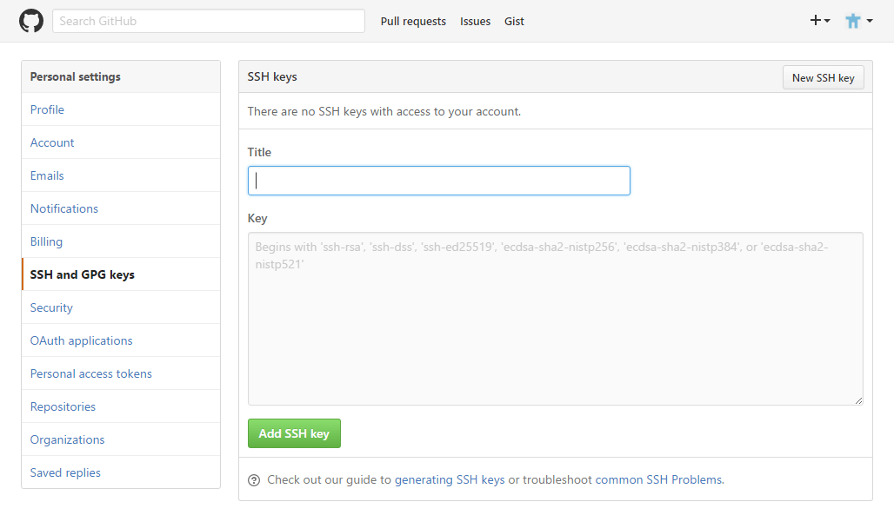

SSH 連線設定
=======


> 此篇主要在說明如何<span style="color: red;">『不使用密碼』</span>的方式與 GitHub 連線。筆者對於有關 SSH 的其它優點並不曉得，所以若不需此功能則可跳過此篇文章。


## 連線方式


在使用 `git clone` 下載時有注意到 Git 的連線方式嗎？分為：

  - HTTP 連線： `https://github.com/<git 檔案路徑>.git`
  - SSH 連線： `git@github.com:<git 檔案路徑>.git`

設定 SSH 連線有兩步驟： 1. 設定金鑰； 2. 連線方式，二者缺一不可。如果一開始不是選擇 SSH 連線的方式也無需重新下載，只要從 `remote` 設定即可。

```sh
git remote remove origin
git remote add origin git@github.com:<git 檔案路徑>.git
```


## 設定金鑰


### 新增 SSH 金鑰


使用 `ssh-keygen` 指令：

```sh
$ ssh-keygen -t rsa -C <電子信箱>
# 預設將在 ~/.ssh 路徑新增 id_rsa、id_rsa.pub 私鑰、公鑰兩個檔案。

$ ssh-keygen -t rsa -f <金鑰名稱> -C <電子信箱>
# -f： 自定金鑰名稱。
```

演示：

```sh
# 在 ~/.ssh/
$ ssh-keygen -t rsa -C <電子信箱>
Enter passphrase (empty for no passphrase): [Type a passphrase]
Enter same passphrase again: [Type passphrase again]
# passphrase 為使用 SSH 金鑰的密碼，但就是想要不輸入密碼所以這留白就好。
```


### Github 設定


複製公鑰訊息： （<span style="color: red;">「&lt;名稱&gt;.pub」的才是公鑰</span>）

```sh
# clip 指令可將檔案內容複製至剪貼簿
$ clip < <檔案路徑>
```


Github 路徑： `account > setting > SSH and GPG Keys`



在點選「New SSH key」按鈕，設定填寫後並確認 Github 密碼就完成了。


### 連線測試


```sh
$ ssh -T <主機名稱>

$ ssh -vT <主機名稱>
# -v： 輸出連線訊息。
```


## 管理多組金鑰


建立 `~/.ssh/config`  檔案來管理 SSH 金鑰所對應的網站。


更改權限：

```sh
$ chmod 644 ~/.ssh/config
$ la
drwx------+ 1 chmiz None    0 七月 13 07:19 ./
drwxrwxr-x+ 1 chmiz None    0 七月 13 07:19 ../
-rw-r--r--+ 1 chmiz None  305 七月 13 08:10 config
#----w--w-+ <= 有這兩個會無法使用 
```


config 設定格式：

```
# 提示註解
Host <自訂遠端主機的別名>
    HostName <遠端主機名稱>
    IdentityFile ~/.ssh/<金鑰名稱>
```


連線測試：

```sh
$ ssh -T <自訂遠端主機的別名>
```


## 參考資料

  - [學習筆記: 使用git push不再需要輸入帳號密碼](http://doraak47.blogspot.tw/2013/05/git-push.html)
  - [如何用config管理多個網站的ssh key和如何不用每一組輸入ssh的Pass Phrase @ Alan Tsai 的學習筆記](http://blog.alantsai.net/2016/03/ssh-config-ssh-agent-passphrase-management.html)
  - [linux - ssh hostname returns "Bad owner or permissions on ~/.ssh/config" - Server Fault](http://serverfault.com/questions/253313/ssh-hostname-returns-bad-owner-or-permissions-on-ssh-config)

